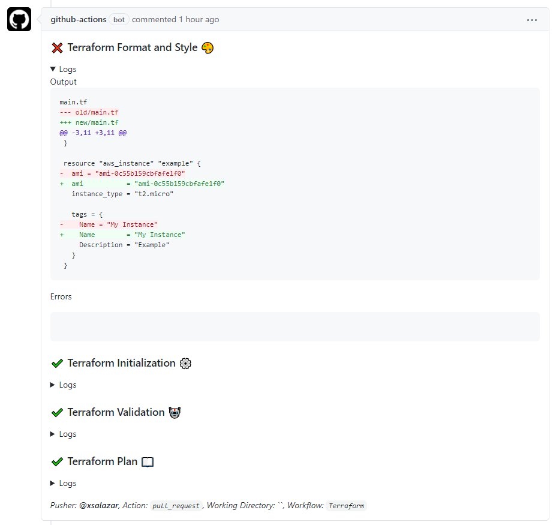
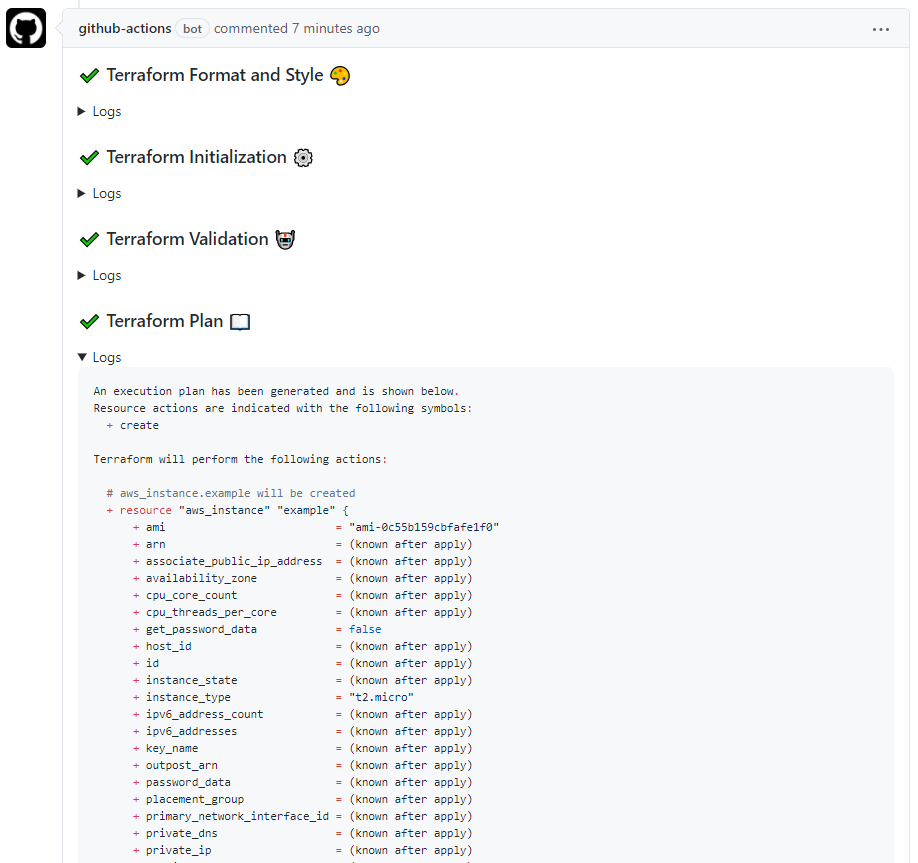

# Terraform GitHub Actions Examples
This repository is a set of small examples that show how to use the official [Terraform GitHub Actions](https://github.com/hashicorp/terraform-github-actions) to run on your personal repositories.

## Getting Started
The official Terraform documentation can be found [here](https://www.terraform.io/docs/github-actions/index.html)

### Setting up secrets
In order to run `terraform plan` or `terraform apply`, you will potentially need to setup credentials to allow for the workflow to properly communicate with any cloud providers you may be using. In this example, since I am setting up an AWS provider and creating an EC2 instance, I need to pass through AWS credentials.

You provision these per-repository. You can setup these secrets by going to the repository Settings > Secrets > Add new secret.

Once created, you can reference those secrets from the workflow by using `${{ secrets.AWS_ACCESS_KEY_ID }}`.

It is worth noting that `GITHUB_TOKEN` is [automatically provided](https://help.github.com/en/github/automating-your-workflow-with-github-actions/virtual-environments-for-github-actions#github_token-secret) to workflows, and you do not need to manually set this up.

### YAML Syntax
The example workflow definition can be found in [.github/workflows/terraform.yml](.github/workflows/terraform.yml). The HCL-syntax support that was originally released with GitHub Actions has been deprecated, so all workflows or samples written in HCL either need to be [converted or rewritten](https://help.github.com/en/github/automating-your-workflow-with-github-actions/about-github-actions#migrating-github-actions-from-hcl-to-yaml-syntax).

## Actions

### `terraform fmt`
You can see an example of this command being run in [this pull request](https://github.com/xsalazar/terraform-github-actions-example/pull/1).

### `terraform plan`
You can see an example of this command being run in [this pull request](https://github.com/xsalazar/terraform-github-actions-example/pull/2). The plan output is too long to include here, but you can expand the output in the original comment.

### `terraform validate`
You can see an example of this command being run in [this pull request](https://github.com/xsalazar/terraform-github-actions-example/pull/3).

